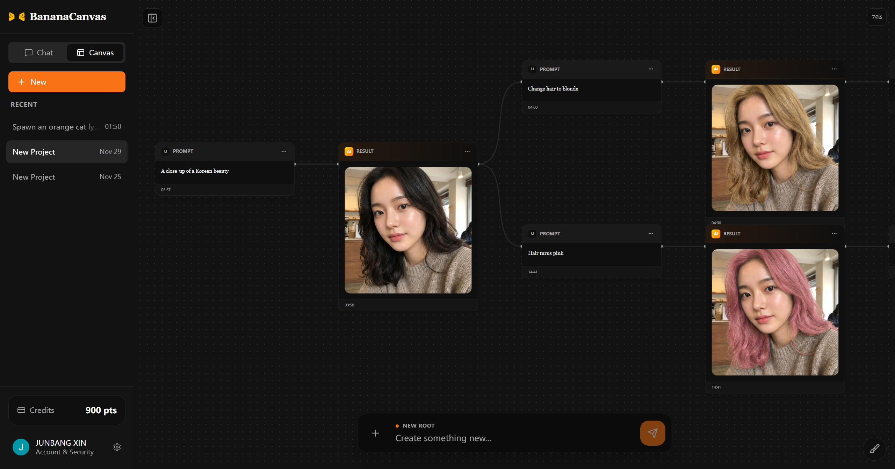

<div align="center">


# BananaCanvas AI
### AI 驱动的多模态创作工作室

[](https://nextjs.org/)
[](https://supabase.com/)
[](https://tailwindcss.com/)
[](https://www.typescriptlang.org/)
[](LICENSE)

[English](README.md) | [中文说明](README_CN.md)

</div>

BananaCanvas AI 是一个前沿的创意工作区，结合了基于对话的 AI 交互和无限画布，用于多模态内容创作。项目基于 Next.js 15 和 Supabase 构建，为生成、编辑和组织 AI 生成的内容提供了无缝体验。

## 🚀 功能特性

- **💬 AI 对话工作区**：与先进的 AI 模型 (Gemini) 无缝交互，实时生成高质量的文本和图像。
- **🎨 无限画布**：一个无边界的创意空间，您可以自由拖拽、放置和组织您的创意、图片和笔记。
- **🖼️ 图像生成**：集成 AI 图像生成工具，直接在您的工作流中创造令人惊叹的视觉效果。
- **💳 订阅系统**：集成强大的 Creem 支付系统，提供灵活的基于积分的用量模式。
- **⚙️ 全面的设置**：完全控制您的个人资料、安全和账单偏好。
- **🌑深色模式**：精心设计的用户界面，在深色和浅色模式下都美观大方。
- **🔒 安全认证**：使用 Supabase Auth 和行级安全 (RLS) 提供企业级安全性。

## 🛠️ 技术栈

### 核心
- **框架**: [Next.js 15](https://nextjs.org/) (App Router)
- **语言**: [TypeScript](https://www.typescriptlang.org/)
- **样式**: [Tailwind CSS](https://tailwindcss.com/)

### 后端 & 数据库
- **BaaS**: [Supabase](https://supabase.com/) (PostgreSQL, Auth, Realtime, Storage)
- **邮件**: [Resend](https://resend.com/)

### UI & 组件
- **组件库**: [Radix UI](https://www.radix-ui.com/)
- **动画**: [Framer Motion](https://www.framer.com/motion/)
- **图标**: [Lucide React](https://lucide.dev/)

### AI & 集成
- **AI 模型**: [Google Generative AI SDK](https://www.npmjs.com/package/@google/genai)
- **验证**: [Zod](https://zod.dev/)
- **支付**: [Creem](https://creem.io/)

## 🏁以此开始

### 前提条件

请确保您已安装/设置以下内容：
- Node.js 18+
- Supabase 项目
- Google Gemini API Key
- Creem 账户 (用于支付)

### 安装

1. **克隆仓库:**
   ```bash
   git clone https://github.com/yourusername/bananacanvas-ai.git
   cd bananacanvas-ai
   ```

2. **安装依赖:**
   ```bash
   npm install
   ```

3. **设置环境变量:**
   在根目录下创建一个 `.env.local` 文件并添加以下内容：

   ```env
   # Supabase
   NEXT_PUBLIC_SUPABASE_URL=your_supabase_url
   NEXT_PUBLIC_SUPABASE_ANON_KEY=your_supabase_anon_key
   SUPABASE_SERVICE_ROLE_KEY=your_service_role_key

   # Google Gemini
   GEMINI_API_KEY=your_gemini_api_key

   # Creem Payments
   CREEM_API_KEY=your_creem_api_key
   CREEM_WEBHOOK_SECRET=your_webhook_secret
   NEXT_PUBLIC_CREEM_PRODUCT_ID_STARTER=...
   NEXT_PUBLIC_CREEM_PRODUCT_ID_PRO=...
   NEXT_PUBLIC_CREEM_PRODUCT_ID_BUSINESS=...
   NEXT_PUBLIC_CREEM_PRODUCT_ID_CREDITS_300=...
   # ... 添加其他产品 ID

   # Resend
   RESEND_API_KEY=your_resend_api_key
   ```

4. **数据库设置:**
   在您的 Supabase SQL 编辑器中运行位于 `supabase/migrations` 的 SQL 迁移文件，以设置架构和 RLS 策略。
   > **重要提示**: 运行 `20251130_security_hardening.sql` 以确保数据安全。

5. **运行开发服务器:**
   ```bash
   npm run dev
   ```

   在浏览器中打开 [http://localhost:3000](http://localhost:3000) 查看结果。

## 📂 项目结构

```
bananacanvas-ai/
├── app/                  # Next.js App Router 页面和 API 路由
│   ├── chat/             # 聊天功能路由
│   └── (dashboard)/      # 仪表板布局和页面
├── components/           # 可复用 UI 组件
│   ├── ui/               # 基础 UI 组件 (按钮, 输入框等)
│   └── workspace/        # 工作区特定组件
├── lib/                  # 工具函数和共享逻辑
├── supabase/             # Supabase 配置和迁移文件
│   └── migrations/       # SQL 迁移文件
├── public/               # 静态资源 (图片, 图标)
├── styles/               # 全局样式
└── types/                # TypeScript 类型定义
```

## 🔒 安全性

本项目使用 Supabase 中的 **行级安全 (RLS)** 来保护用户数据。所有 API 输入都经过 **Zod** 模式验证的严格校验，以防止格式错误的请求并确保数据完整性。

## 📄 许可证

本项目采用 MIT 许可证 - 详情请参阅 [LICENSE](LICENSE) 文件。
