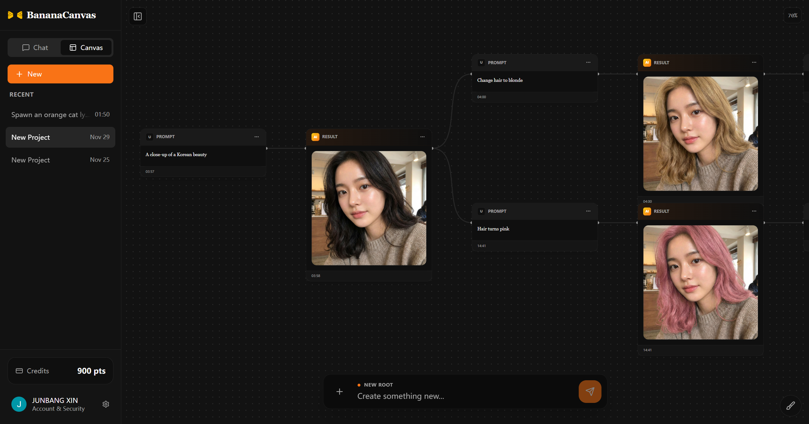

<div align="center">


# BananaCanvas AI
### 无限画布 AI 多模态创作空间

[](https://nextjs.org/)
[](https://supabase.com/)
[](https://tailwindcss.com/)
[](https://www.typescriptlang.org/)
[](LICENSE)

[English](README.md) | [中文说明](README_CN.md)

</div>

**BananaCanvas AI** 是一个基于 Next.js 与 Supabase 的 AI 创作工作台。产品将聊天流与无限画布结合，支持在对话中生成、编辑、组织图片与文本节点，适合创意构思与内容生产场景。

## 核心特性

- **聊天 + 画布双模式**：在线性对话和可视化节点画布之间快速切换。
- **图像生成与编辑**：接入 Gemini 图像能力，支持文字生成与基于上下文图像继续创作。
- **积分与订阅体系**：采用 Creem 支付，服务端 webhook 发放积分并维护订阅状态。
- **多语言支持**：内置英文与中文文案，使用 `next-intl` 进行国际化路由与翻译。

## 技术栈

- 前端：Next.js 15（App Router）、React 19、TypeScript
- UI：Tailwind CSS、Radix UI、Framer Motion
- 状态管理：Zustand
- 后端与数据库：Supabase（Auth + Postgres + RLS）
- AI：Google Generative AI（Gemini）

## 快速开始

### 前置条件

- Node.js 18+
- pnpm
- Supabase 项目
- Gemini API Key
- Creem 商户配置（如需支付功能）

### 安装步骤

1. 克隆仓库

```bash
git clone https://github.com/yourusername/bananacanvas-ai.git
cd bananacanvas-ai
```

2. 安装依赖

```bash
pnpm install
```

3. 配置环境变量

参考 `.env.example` 创建 `.env.local`，至少填写：

```env
NEXT_PUBLIC_APP_URL=http://localhost:3000
NEXT_PUBLIC_SUPABASE_URL=your_supabase_url
NEXT_PUBLIC_SUPABASE_ANON_KEY=your_supabase_anon_key
SUPABASE_SERVICE_ROLE_KEY=your_service_role_key
GEMINI_API_KEY=your_gemini_api_key
```

4. 启动开发服务

```bash
pnpm dev
```

打开 [http://localhost:3000](http://localhost:3000)。

## 数据与安全

- 依赖 Supabase RLS 保护用户项目与消息数据。
- 支付状态与积分发放由服务端 Creem webhook 统一处理。
- 关键接口已加入请求校验、限流与结构化日志。

## 许可证

本项目基于 MIT License，详见 [LICENSE](LICENSE)。
